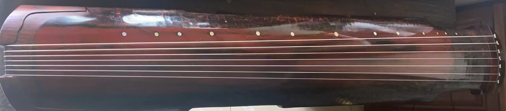
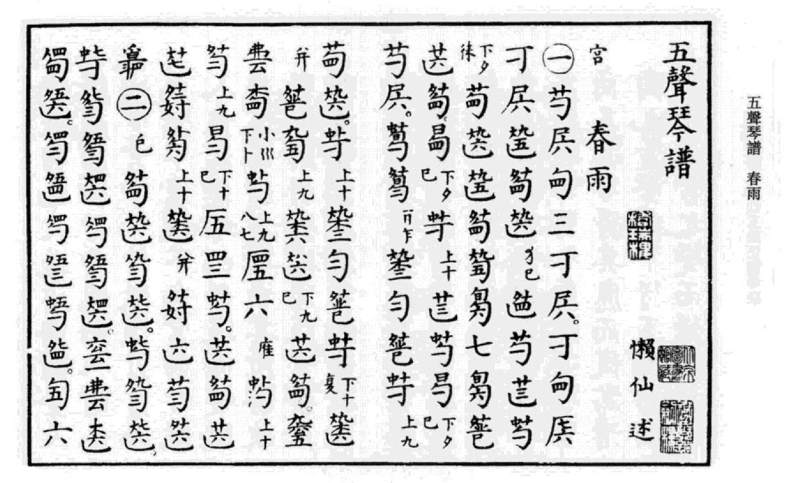
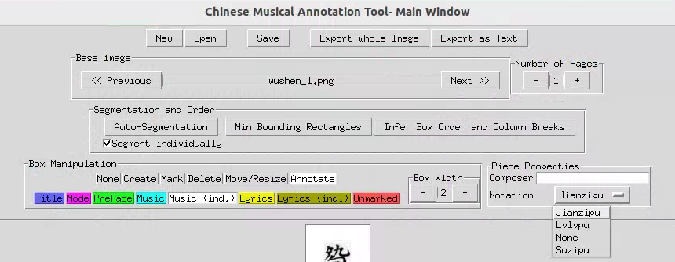

<!-- Improved compatibility of back to top link: See: https://github.com/othneildrew/Best-README-Template/pull/73 -->
<a name="Jianzipu MM"></a>
<!--
*** Thanks for checking out the Best-README-Template. If you have a suggestion
*** that would make this better, please fork the repo and create a pull request
*** or simply open an issue with the tag "enhancement".
*** Don't forget to give the project a star!
*** Thanks again! Now go create something AMAZING! :D
-->

<!-- PROJECT LOGO -->

<div align="center">
  <a href="https://github.com/github_username/repo_name">
    
  </a>

<h3 align="center">Jianzipu MM</h3>

  <p align="center">
    Ancient Chinese Qing Score Jianzipu(JZP)
    <br />
    <a href="https://github.com/github_username/repo_name">View Demo</a>
    ·
    <a href="https://github.com/github_username/repo_name/issues/new?labels=bug&template=bug-report---.md">Report Bug</a>
    ·
    <a href="https://github.com/github_username/repo_name/issues/new?labels=enhancement&template=feature-request---.md">Request Feature</a>
  </p>
</div>


<!-- ABOUT THE PROJECT -->
## About The Project
### Guqin 古琴




This is a traditional Chinese musical instrument Guqin. A distinctive system known as Jianzipu (JZP), which utilizes reduced Chinese character notation, is employed to record guqin music. Our project aims to use the latest artificial intelligent technology to read the JZP and play the proper music from JZP.

<p align="right">(<a href="#readme-top">back to top</a>)</p>

<!-- GETTING STARTED -->
## Getting Started

We have two system for Jiazipu. The first one is from Jianzipu to the Jianzi document and a system to generate the music from our Jianzi document.

### Prerequisites

We mainly use python and here we list some baseline and python with a gpu enviroment. 
* python 3.10
* pytorch

```commandline
pip install -r requirements.txt
```

### Baseline

#### Jianzipu OCR
1. JZP notation: We use 五声琴谱 for our ocr dataset. The dataset made by [Suzi AI](https://github.com/SuziAI/gui-tools/tree/main). The SuziAI is a tool for notation. Please follow the gui-tool tutorial to make sure you can do the notation work.
2. JZP recognition: The JZP recognition model is trained with folloing method. In order to know which one is better, we need to evaluate the folloing method on our data. 
* [Clip](https://github.com/openai/CLIP)
* [FudanOCR](https://github.com/FudanVI/FudanOCR/)
* [Japanese OCR]()
3. Basic NLP Method: Transformer series model.

#### Gui-tools for JZP tutorial
1. To strart the annotation tool, first switch the composer button to **jianzipu** button and use **open** to open a jianzipu image folder. 
2. Press **Auto-Segmentation** button to get the annotation boxes from picture. And press **Music(ind.)** to annotate the Jianzi Character. 

3. Follow the video to annotate the JZP character.

<video width="320" height="240" controls>
    <source src="images/tutorial.mp4" type="video/mp4">
</video>


4. After finished annotation, we will soon developed a json-string tool to get the description of Jianzi character. The tool is in developing, to be continued...

#### Guqin music generation
Guqin music generation system is aim to generate music from JZP document. Since the JZP notation doesn't include some music features, we need train our model with both document and music. The datasets includes two parts: the music parts are collected from Guqin exam videos and online video resources, the sequence parts are collected from our JZP OCR parts.

0. basic sound generation model: [VAE](https://github.com/AntixK/PyTorch-VAE), VQVAE, [Diffusion](https://github.com/CompVis/stable-diffusion), [Sound Stream](https://github.com/wesbz/SoundStream)... 
1. Symbolic Music Generation: [Muzic](https://github.com/microsoft/muzic/tree/mainhttps://github.com/microsoft/muzic/tree/main)
2. Music generation from text: [MusicLM](https://google-research.github.io/seanet/musiclm/examples/)


<!--Todo List -->
## Todo List
1. Construct dataset: Our dataset need both JZP images and JZP representation list. The images comes from the Wushen scores and JZP representation comes from the gui-tool
2. JZP recognition model train: This model includes two parts, the JZP character sequence generation and JZP document generation.
3. Guqin music model train.
4. A system of our work and a novel evalutaion system for our work. The evalutaion system need consider both human side and computer science side.

<!-- CONTRIBUTING -->
## Contributing
If you have a suggestion that would make this better, please fork the repo and create a pull request. You can also simply open an issue with the tag "enhancement".
Don't forget to give the project a star! Thanks again!

1. Fork the Project
2. Create your Feature Branch (`git checkout -b feature/AmazingFeature`)
3. Commit your Changes (`git commit -m 'Add some AmazingFeature'`)
4. Push to the Branch (`git push origin feature/AmazingFeature`)
5. Open a Pull Request

<p align="right">(<a href="#readme-top">back to top</a>)</p>


<!-- LICENSE -->
## License

Distributed under the MIT License. See `LICENSE.txt` for more information.

<p align="right">(<a href="#readme-top">back to top</a>)</p>


<!-- CONTACT -->
## Contact

Zheng Youcheng - 220226411@seu.edu.cn

Project Link: [https://github.com/github_username/repo_name](https://github.com/github_username/repo_name)

<p align="right">(<a href="#readme-top">back to top</a>)</p>


